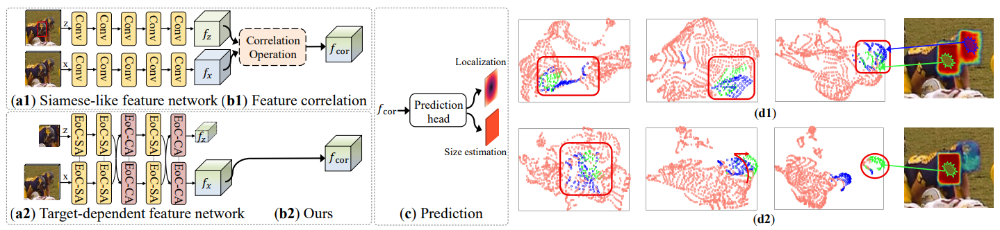
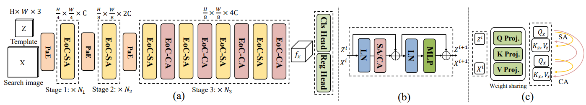

## [Correlation-Aware Deep Tracking (Single Branch Transformer Tracking)](https://arxiv.org/abs/2203.01666)

### :star: Our paper is accepted by CVPR2022 ! This is the reproduced version of our work "Correlation-Aware Deep Tracking". You can find the paper [here](https://arxiv.org/abs/2203.01666). 

### :star: For an improved version SuperSBT, [Correlation-Embedded Transformer Tracking: A Single-Branch Framework](https://arxiv.org/pdf/2401.12743), please go to this [github repository](https://github.com/phiphiphi31/SuperSBT)
 


```bibtex
Fei Xie, Chunyu Wang, Guangting Wang, Yue Cao, Wankou Yang, Wenjun Zeng

This work was done when Fei Xie was an intern at Microsoft Research Asia
```


(a1) standard Siamese-like feature extraction; (a2) our target-dependent feature extraction; (b1) correlation step, such as Siamese
cropping correlation [23], DCF [11] and Transformer-based correlation [5] ; (b2) our pipeline removes separated correlation step; (c)
prediction stage; (d1)/(d2) are the TSNE [38] visualizations of search features in (a1)/(a2) when feature networks go deeper


(a) architecture of our proposed Single Branch Transformer for tracking. Different from Siamese, DCF and Transformer-based
methods, it does not have a standalone module for computing correlation. Instead, it embeds correlation in all Cross-Attention layers which
exist at different levels of the networks. The fully fused features of the search image are directly fed to Classification Head (Cls Head) and
Regression Head (Reg Head) to obtain localization and size embedding maps. (b) shows the structure of a Extract-or-Correlation (EoC)
block. (c) shows the difference of EoC-SA and EoC-CA. PaE denotes patch embedding. LN denotes layer normalization.


## Abstract
Robustness and discrimination power are two fundamental requirements in visual object tracking. In most tracking paradigms, we find that the features extracted by the popular Siamese-like networks cannot fully discriminatively model the tracked targets and distractor objects, hindering them from simultaneously meeting these two requirements. While most methods focus on designing robust correlation operations, we propose a novel target-dependent feature network inspired by the self-/cross-attention scheme. In contrast to the Siamese-like feature extraction, our network deeply embeds cross-image feature correlation in multiple layers of the feature network. By extensively matching the features of the two images through multiple layers, it is able to suppress non-target features, resulting in instance-varying feature extraction. The output features of the search image can be directly used for predicting target locations without extra correlation step. Moreover, our model can be flexibly pre-trained on abundant unpaired images, leading to notably faster convergence than the existing methods. Extensive experiments show our method achieves the state-of-the-art results while running at real-time. Our feature networks also can be applied to existing tracking pipelines seamlessly to raise the tracking performance.

## Model file and results 
models and raw results can be downloaded from Baidu NetDisk (password:ne0x):

[**[Models, Raw resuls and Training logs(password:ne0x)]**](https://pan.baidu.com/s/1LMWhIHxvSXkV27QhaNp1Lw?pwd=ne0x)


## Results
We obtain the state-of-the-art results on several benchmarks while running at high speed. 
More results are coming soon. 

<table>
  <tr>
    <th>Model</th>
    <th>GOT-10k<br>AO (%)</th>
    <th>GOT-10k<br>SR0.5 (%)</th>
    <th>GOT-10k<br>SR0.75 (%)</th>
    <th>Speed<br></th>
    <th>Params<br></th>
  </tr>
  <tr>
    <td>SBT-base</td>
    <td>69.7</td>
    <td>79.9</td>
    <td>64.1</td>
    <td>40fps</td>
    <td>25.1M</td>
  </tr>
  <tr>
</table>

<table>
  <tr>
    <th>Model</th>
    <th>LaSOT<br>AUC (%)</th>
    <th>LaSOT<br>Precision</th>
    <th>LaSOT<br>Norm. Precision</th>
    <th>Speed<br></th>
    <th>Params<br></th>
  </tr>
  <tr>
    <td>SBT-base</td>
    <td>68.0</td>
    <td>73.9</td>
    <td>77.8</td>
    <td>40fps</td>
    <td>25.1M</td>
  </tr>
  <tr>
</table>
    
#### Install dependencies
* Docker image
    ```
    We also provide a docker image for reproducing our results:
    jaffe03/dualtfrpp:latest
    ```   
* Create and activate a conda environment 
    ```bash
    conda create -n SBT python=3.7
    conda activate SBT
    ```  
* Install PyTorch
    ```bash
    conda install -c pytorch pytorch=1.6 torchvision=0.7.1 cudatoolkit=10.2
    ```  

* Install other packages
    ```bash
    conda install matplotlib pandas tqdm
    pip install opencv-python tb-nightly visdom scikit-image tikzplotlib gdown
    conda install cython scipy
    sudo apt-get install libturbojpeg
    pip install pycocotools jpeg4py
    pip install wget yacs
    pip install shapely==1.6.4.post2
    pip install mmcv timm
    ```  
* Setup the environment                                                                                                 
Create the default environment setting files.

#### For training
* Full dataset training (lasot, got10k, coco, trackingnet):
    ```bash
    python -m torch.distributed.launch --nproc_per_node 8 lib/train/run_training_sbt.py --script sbt --config sbt_base --save_dir ./
    ```  
* got10k dataset training (lasot, got10k, coco, trackingnet):
    ```bash
    python -m torch.distributed.launch --nproc_per_node 8 lib/train/run_training_sbt.py --script sbt --config sbt_base_got --save_dir ./
    ```  
#### For testing
* For examplem, in lasot testing set:
    ```bash
    python ./tracking/test.py --tracker_name sbt --tracker_param sbt_base --dataset lasot --threads 0
    python ./tracking/analysis_results_ITP.py --script  sbt --config sbt_base
    ```  


## Acknowledgement
This is a modified version of the python framework [PyTracking](https://github.com/visionml/pytracking) based on **Pytorch**, 
also borrowing from [PySOT](https://github.com/STVIR/pysot), [GOT-10k](https://github.com/got-10k/toolkit) and [Vision Transformer](https://github.com/lucidrains/vit-pytorch), such as [Swin Transformer](https://github.com/microsoft/Swin-Transformer), [PVT](https://github.com/whai362/PVT), [Twins](https://github.com/Meituan-AutoML/Twins). 
We would like to thank their authors for providing great code and framework. 

## Contacts
* Fei Xie, Shanghai Jiao Tong University, China, 372998044@qq.com
      
    
## Citing SBT
If you find SBT useful in your research, please consider citing:
```bibtex
@inproceedings{xie2022sbt,
  title={Correlation-aware deep tracking},
  author={Xie, Fei and Wang, Chunyu and Wang, Guangting and Cao, Yue and Yang, Wankou and Zeng, Wenjun},
  booktitle={Proceedings of the IEEE/CVF Conference on Computer Vision and Pattern Recognition},
  year={2022}
}
```
